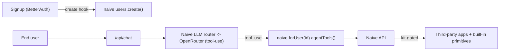
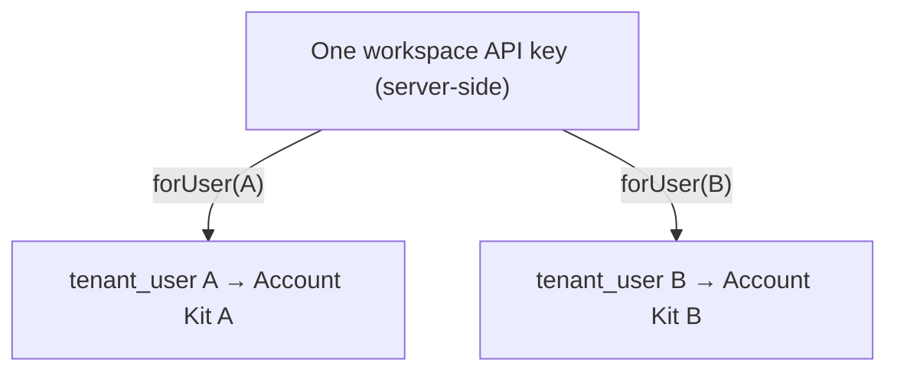

<div align="center">

<picture>
  <source media="(prefers-color-scheme: dark)" srcset="public/naive-logo-dark.svg">
  
</picture>

# Naive Starter

### 🤖 An AI-native, multi-tenant SaaS starter template

Every end-user signs up and gets **their own AI assistant** that connects third-party apps, manages encrypted credentials, and runs native business primitives — all isolated per user and governed by an Account Kit.

<br/>


[Quick start](#-quick-start) · [How it works](#-how-it-works) · [Deploy](#-deploy-your-own) · [Customize](#-customizing)

</div>

---

## ✨ What you get

| | Page | What it shows |
| --- | --- | --- |
| 💬 | **Chat** | A streaming agent loop powered by `agentTools()` — searches/connects apps, runs capabilities, and calls native primitives. Its LLM calls run through Naive's LLM router (`client.llm`, OpenRouter — any of 300+ models). |
| 💳 | **Cards** | Per-user virtual payment cards (`client.cards`). |
| 📬 | **Email** | Per-user inboxes on a Naive domain (`client.email`). |
| 🔌 | **Connections** | Connect third-party apps (Gmail, GitHub, Slack, …) per user. |
| 🔐 | **Credentials** | A per-user, KMS-encrypted vault (`client.vault`). |
| ✅ | **Approvals** | Human-in-the-loop queue for sensitive agent actions. |

> Cards & Email are sample primitive pages — the same `client.<primitive>` pattern extends to domains, verification, formation, and social.

## 🤔 Why this template

Wiring an AI agent into a *real* product takes more than a chat box. You need:

- 👥 **Per-user identity** — each app user maps 1:1 to a Naive `tenant_user`.
- 🔒 **Isolation** — one server-side API key; every call scoped via `naive.forUser(id)`.
- 🌐 **Reach** — the agent can use ~1000 third-party apps *and* native primitives.
- 🛡️ **Governance** — sensitive actions are gated by each user's Account Kit and surface as approvals.

This repo shows the **entire integration** in a small, readable codebase you can clone and ship.

## 🧱 Tech stack

- ⚡ **Next.js 15** (App Router) — UI + API routes
- 🔑 **BetterAuth** — email/password auth
- 🗄️ **Drizzle ORM** + **libSQL/SQLite** — zero-infra local DB
- 🧠 **Any model via Naive** — the chat routes through Naive's LLM router (OpenRouter; 300+ models, defaults to Claude Sonnet), no direct provider key
- 🧩 **@usenaive-sdk/node** — multi-tenant business infrastructure

---

## 🚀 Deploy your own

[](https://vercel.com/new/clone?repository-url=https://github.com/usenaive/naive-starter&env=NAIVE_API_KEY,BETTER_AUTH_SECRET,BETTER_AUTH_URL,DATABASE_URL,DATABASE_AUTH_TOKEN&envDescription=Naive%20%2B%20Auth%20%2B%20Database%20credentials&project-name=naive-starter&repository-name=naive-starter)

> ⚠️ Point `repository-url` at your own repo/fork. Production needs a hosted database — see [Deployment](#-deployment).

---

## ⚡ Quick start

**Prerequisites**

- 🟢 Node.js 20+
- 🔑 A Naive workspace API key (+ optional Account Kit) from the [Naive dashboard](https://usenaive.ai) — the only provider key you need; chat + LLM route through Naive

**1. Get your Naive credentials**

- 📝 Sign up at the Naive dashboard.
- 🎛️ *(Optional)* Create an **Account Kit** — allowlist apps (`gmail`, `github`, …) and enable primitives (`cards`, `email`, …). Copy its id; blank uses your default kit.
- 🔑 Create a **workspace API key** (Settings → API Keys). Copy it.

**2. Configure environment**

```bash
cp .env.example .env
```

Fill in the values (see [Environment variables](#-environment-variables)). Minimum: `NAIVE_API_KEY`, `BETTER_AUTH_SECRET`.

**3. Install, migrate, run**

```bash
npm install
npm run db:push     # create the local SQLite tables
npm run dev         # → http://localhost:3400
```

**4. Try it** — sign up, then in the chat:

- 💬 *"What can you do for me?"* — lists apps + primitives
- 🔌 *"Connect my GitHub"* — third-party app lane (OAuth link)
- 💳 *"Issue a $50 virtual card"* — native primitive (may need approval)

---

## 🧩 How it works

The **entire Naive integration lives in three files** — read these:

- 1️⃣ **Provision on signup** → [`lib/auth.ts`](lib/auth.ts): a BetterAuth `create.after` hook calls `naive.users.create({ external_id })` and stores the id on `user.naiveUserId`.
- 2️⃣ **Scope to the user** → [`lib/naive.ts`](lib/naive.ts): `requireNaiveUser()` resolves the session to `naive.forUser(naiveUserId)`.
- 3️⃣ **Give the agent tools** → [`app/api/chat/route.ts`](app/api/chat/route.ts): `client.agentTools()` returns the tool defs + a `handle()` dispatcher, run in a streaming loop. The LLM calls go through Naive's LLM router (`client.llm`, OpenRouter) — any model, billed in Naive credits, no direct provider key (set `NAIVE_LLM_MODEL` to switch models).



### 👥 Multi-tenancy

- 🔑 One secret API key lives on the **server only**.
- 🎯 `naive.forUser(id)` pins every request to `/v1/users/{id}` — no method ever takes a `userId`.
- 🧱 Connections, vault, cards, and every primitive are **isolated per user** and enforced by that user's Account Kit.



### 🛠️ The agent's tools (two lanes, not 1000s of schemas)

- 🌐 **Third-party apps** — `naive_search_apps`, `naive_list_connections`, `naive_connect_app`, `naive_list_capabilities`, `naive_run_capability`. Reaches ~1000 external OAuth apps and all their capabilities.
- 🧩 **Built-in primitives** — `naive_search_primitives` (discover primitives + methods + arg schemas) and `naive_run_primitive` (execute, e.g. `primitive='cards', method='create'`). Covers cards, email, domains, vault, KYC, formation, social, approvals, and `llm` (OpenRouter chat completions).

> 🔁 Same `search → run` pattern for both lanes. `naive_search_apps` is third-party only. Sensitive methods return `pending_approval` and surface in the Approvals tab.

### 📡 Streaming

- `/api/chat` streams newline-delimited JSON (`text`, `tool`, `pending`, `done`, `error`).
- The client renders replies token-by-token; conversations persist in `localStorage`; "New chat" clears them.

---

## 🗂️ Project structure

```
.
├── app/
│   ├── api/                 # Server routes — ALL Naive calls happen here
│   │   ├── chat/route.ts    # 💬 streaming agent loop (agentTools + client.llm/OpenRouter)
│   │   ├── cards/route.ts   # 💳 cards primitive
│   │   ├── email/route.ts   # 📬 email primitive
│   │   ├── connections/     # 🔌 third-party app connections
│   │   ├── vault/route.ts   # 🔐 credentials vault
│   │   ├── approvals/       # ✅ human-in-the-loop queue
│   │   └── auth/[...all]/    # 🔑 BetterAuth handler
│   ├── app/                 # Authenticated UI (chat + primitive pages)
│   ├── login/ · signup/     # Auth pages
│   └── layout.tsx · globals.css · page.tsx
├── components/              # Shared UI (ui.tsx, auth-ui.tsx)
├── db/                      # Drizzle schema + libSQL client
├── lib/
│   ├── naive.ts             # ⭐ SDK wiring: provisioning + requireNaiveUser()
│   ├── auth.ts              # BetterAuth config + provisioning hook
│   ├── auth-client.ts       # Client-side auth helpers
│   └── api-utils.ts         # Error → response helper
├── .env.example
└── drizzle.config.ts
```

---

## 🔑 Environment variables

| Variable | Required | Description |
| --- | :---: | --- |
| `NAIVE_API_KEY` | ✅ | Workspace API key (Naive dashboard → Settings → API Keys). Powers everything — the chat LLM calls route through Naive's LLM router (OpenRouter), so no direct provider key is needed. |
| `BETTER_AUTH_SECRET` | ✅ | Session-signing secret. `openssl rand -base64 32`. |
| `BETTER_AUTH_URL` | ✅ prod | App base URL. `http://localhost:3400` in dev; your deployed URL in prod. |
| `NAIVE_API_URL` | ➖ | Naive API base. Defaults to `https://api.usenaive.ai`. |
| `NAIVE_LLM_MODEL` | ➖ | OpenRouter model id for the chat loop. Defaults to `anthropic/claude-sonnet-4.6`. |
| `NAIVE_ACCOUNT_KIT_ID` | ➖ | Account Kit for new users. Blank = workspace default. |
| `DATABASE_URL` | ➖ | libSQL/SQLite URL. Defaults to `file:./dev.db`. |
| `DATABASE_AUTH_TOKEN` | ➖ | Auth token for a hosted libSQL/Turso database. |

---

## ✅ Testing & quality

```bash
npm run typecheck   # tsc --noEmit
npm run build       # production build
```

**Manual QA** (sign up first, then chat):

- [ ] 💬 *"What can you do for me?"* → describes apps + primitives
- [ ] 🔌 *"Connect my GitHub"* → OAuth link; shows on **Connections**
- [ ] 📬 *"Create an inbox called support"* then *"send an email from it"* → **Email** updates
- [ ] 🌐 *"Is `example.com` available?"* → domain check (no purchase)
- [ ] 🔐 *"Store my OpenAI key as `openai.key`"* → appears in **Credentials**
- [ ] 💳 *"Issue a $50 virtual card"* → if gated, shows in **Approvals**; approve to run

---

## ☁️ Deployment

Standard Next.js app — deploys anywhere. For [Vercel](https://vercel.com):

1. ⬆️ Push to GitHub and import into Vercel (or use the [Deploy button](#-deploy-your-own)).
2. 🗄️ **Use a hosted database** — serverless filesystems are ephemeral, so `file:./dev.db` won't persist. Create a [Turso](https://turso.tech) DB and set `DATABASE_URL` + `DATABASE_AUTH_TOKEN`. *(Or switch the dialect to Postgres in [`drizzle.config.ts`](drizzle.config.ts) + [`db/index.ts`](db/index.ts).)*
3. 🧱 Apply the schema once: `DATABASE_URL=… DATABASE_AUTH_TOKEN=… npm run db:push`.
4. 🔑 Set all [environment variables](#-environment-variables) in Vercel; set `BETTER_AUTH_URL` to your deployed URL.
5. 🚀 Deploy.

---

## 🎨 Customizing

- 🏷️ **Rebrand** — "Acme AI" + avatar live in [`app/app/nav.tsx`](app/app/nav.tsx) and [`components/auth-ui.tsx`](components/auth-ui.tsx); theme tokens in [`app/globals.css`](app/globals.css).
- ➕ **Add a primitive page** — copy a route in `app/api/<primitive>/route.ts` (thin pass-through to `client.<primitive>`) + a page under `app/app/<primitive>/`. The agent already reaches every primitive via `naive_run_primitive`.
- 🛡️ **Control agent permissions** — configure each user's **Account Kit** in the dashboard (allowed apps, enabled primitives, what needs approval).
- 🗄️ **Swap the database** — point at Turso, or change the Drizzle dialect for Postgres.

---

## 🛟 Troubleshooting

- 🤖 **Agent says a built-in feature "isn't available"** → ensure `@usenaive-sdk/node` is `^0.5.0`+ and restart `npm run dev` (Next caches resolved deps).
- ⏳ **A sensitive action never runs** → it's waiting in **Approvals** (gated by the Account Kit). Approve it, or relax the kit policy.
- 🔁 **Auth redirect loops in production** → set `BETTER_AUTH_URL` to your exact deployed origin.
- 🗄️ **`db:push` fails on Vercel** → run it against the hosted DB with the production `DATABASE_URL`/`DATABASE_AUTH_TOKEN`.

---

## 📚 Learn more

- 🧩 [Naive](https://usenaive.ai) — the platform powering this template
- ⚡ [Next.js App Router](https://nextjs.org/docs/app)
- 🔑 [BetterAuth](https://www.better-auth.com/)
- 🗄️ [Drizzle ORM](https://orm.drizzle.team/)
- 🧠 [Anthropic API](https://docs.anthropic.com/)

---

<div align="center">

Built with [Naive](https://usenaive.ai) · [MIT](LICENSE) licensed

</div>
